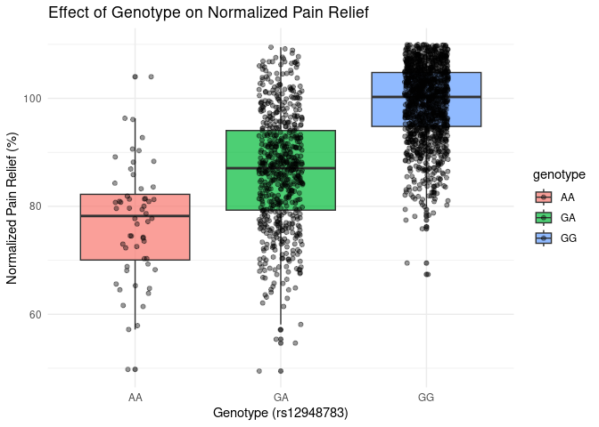

Opioid Therapy Response in European Cancer Patients
================
Michael Popa
2025-11-22

- [ABSTRACT](#abstract)
- [BACKGROUND](#background)
- [STUDY QUESTION and HYPOTHESIS](#study-question-and-hypothesis)
- [Question](#question)
- [Hypothesis](#hypothesis)
- [Prediction](#prediction)
- [METHODS](#methods)
- [ANALYSIS](#analysis)
- [DISCUSSION](#discussion)
- [CONCLUSION](#conclusion)
- [REFERENCES](#references)

# ABSTRACT

Opioid pain relief varies considerably among cancer patients, and
genetic factors likely contribute to this variation. Using summary EPOS
data, we generated two visual analyses: (1) a simple regression testing
how enrichment strength (−log₁₀ p) relates to the number of genes per
term (Table 2), and (2) a chromosome-level visualization of SNP
associations highlighting rs12948783 near RHBDF2 (Table 3). The
regression indicated that larger gene sets tend to show stronger
enrichment, and the SNP plot illustrated where the most significant
genomic signals were located. Because only summary tables were available
rather than patient-level data, we also included a draft
multiple-regression model (dose × genotype with covariates) to indicate
how individual-level analyses would proceed if those data become
available. Overall, these results contextualize the genetic patterns
observed in EPOS and help motivate future work toward individualized
opioid pain management.

# BACKGROUND

Opioid-based pain control shows remarkable variability across patients
even when doses are similar, and while clinical factors explain portions
of this, prior EPOS analyses suggest that genetics also plays an
important role. One variant of interest remains rs12948783 near RHBDF2.
Working from the summary tables available rather than row-level patient
outcomes, we focused first on visualizing the data to establish a
foundation for interpreting these genetic signals. Using Table 2, we
assessed whether larger gene sets were associated with stronger
enrichment scores, and from Table 3, we examined where rs12948783 ranked
among the strongest SNP associations across the genome. This allowed us
to maintain the focus on genetic contributors while preparing for future
analyses incorporating individual data such as genotype, sex, country,
and pain relief outcomes.

We imported the EPOS Excel workbook and worked directly with the summary
tables. From Table 2, we ran a simple linear regression of −log₁₀(p) on
gene count and plotted the results with an OLS line and 95% CI. From
Table 3, we plotted −log₁₀(p) against genomic position (Mb) within each
chromosome and highlighted rs12948783; this required cleaning column
headers, removing the note row, and adjusting axis spacing for
legibility. Because patient-level variables (pain relief, dose,
genotype, country, gender) were not available, we included a draft
multiple-regression model as a template—pain_relief ~ dose \* genotype +
country + gender—to illustrate the next analytical step should
individual-level EPOS data be provided. All code associated with these
analyses was written in R using tidyverse and ggplot2 packages.

``` r
# your plotting / model code here

## ---- fig_reg_table2, eval=TRUE, message=FALSE, warning=FALSE---------------
# If needed once in Console: install.packages(c("readxl","dplyr","ggplot2","readr","stringr"))

library(readxl)
library(dplyr)
```

    ## 
    ## Attaching package: 'dplyr'

    ## The following objects are masked from 'package:stats':
    ## 
    ##     filter, lag

    ## The following objects are masked from 'package:base':
    ## 
    ##     intersect, setdiff, setequal, union

``` r
library(ggplot2)
library(readr)
library(stringr)

excel_path <- "BIOL 3070 Final Project DATA POOL.xlsx"

# Read exactly "Table 2"
raw_t2 <- read_excel(excel_path, sheet = "Table 2", .name_repair = "minimal")

# Show a quick peek so we can verify the raw text
cat("\n-- Raw headers --\n"); print(names(raw_t2))
```

    ## 
    ## -- Raw headers --

    ## [1] "Term"       "Gene count" "Pa"         "Genes"

``` r
cat("\n-- Sample values in `Gene count` and `Pa` --\n")
```

    ## 
    ## -- Sample values in `Gene count` and `Pa` --

``` r
print(head(raw_t2[c("Gene count","Pa")], 10))
```

    ## # A tibble: 6 × 2
    ##   `Gene count` Pa         
    ##   <chr>        <chr>      
    ## 1 31           3.5 × 10−5 
    ## 2 17           6.1 × 10−3 
    ## 3 17           6.2 × 10−3 
    ## 4 11           6.8 × 10−3 
    ## 5 10           7.1 × 10−3 
    ## 6 20           7.4 × 10−3 

``` r
# Robust parsing:
# - Handle commas as decimal separators
# - Strip non-numeric characters (e.g., "<", "p=", spaces)
# - Convert to numbers safely
t2 <- raw_t2 %>%
  mutate(
    gene_count_txt = as.character(`Gene count`),
    p_txt          = as.character(Pa),

    # Replace comma decimal with dot, remove spaces
    gene_count_txt = str_replace_all(gene_count_txt, ",", "."),
    p_txt          = str_replace_all(p_txt, ",", "."),

    # Extract numbers (keeps scientific notation like 1e-5)
    gene_count = parse_number(gene_count_txt, locale = locale(decimal_mark = ".")),
    p_value    = parse_number(p_txt,          locale = locale(decimal_mark = ".")),

    neglog10p  = -log10(p_value)
  )

cat("\nRows before filtering:", nrow(t2), "\n")
```

    ## 
    ## Rows before filtering: 6

``` r
t2_ok <- t2 %>% filter(is.finite(gene_count), is.finite(neglog10p), p_value > 0)

cat("Rows after numeric parsing/filter:", nrow(t2_ok), "\n")
```

    ## Rows after numeric parsing/filter: 6

``` r
if (nrow(t2_ok) == 0) {
  stop("\nStill 0 usable rows.\n",
       "Check that 'Gene count' and 'Pa' really contain numbers (not blanks or text labels).\n",
       "The prints above show the first few raw values so we can adjust parsing if needed.")
}

# Linear regression: enrichment strength ~ gene_count
m <- lm(neglog10p ~ gene_count, data = t2_ok)
cat("\n=== Regression summary: -log10(p) ~ gene_count ===\n")
```

    ## 
    ## === Regression summary: -log10(p) ~ gene_count ===

``` r
print(summary(m))
```

    ## 
    ## Call:
    ## lm(formula = neglog10p ~ gene_count, data = t2_ok)
    ## 
    ## Residuals:
    ##         1         2         3         4         5         6 
    ##  0.056607  0.002724 -0.004337  0.035851  0.030486 -0.121330 
    ## 
    ## Coefficients:
    ##              Estimate Std. Error t value Pr(>|t|)    
    ## (Intercept) -1.015586   0.079477 -12.778 0.000216 ***
    ## gene_count   0.013384   0.004189   3.195 0.033050 *  
    ## ---
    ## Signif. codes:  0 '***' 0.001 '**' 0.01 '*' 0.05 '.' 0.1 ' ' 1
    ## 
    ## Residual standard error: 0.071 on 4 degrees of freedom
    ## Multiple R-squared:  0.7185, Adjusted R-squared:  0.6481 
    ## F-statistic: 10.21 on 1 and 4 DF,  p-value: 0.03305

``` r
# Plot: scatter + regression line + CI
ggplot(t2_ok, aes(gene_count, neglog10p)) +
  geom_point(alpha = 0.7) +
  geom_smooth(method = "lm", se = TRUE) +
  labs(
    title = "Enrichment strength vs. gene count",
    x = "Gene count in term",
    y = expression(-log[10](p))
  ) +
  theme_minimal()
```

    ## `geom_smooth()` using formula = 'y ~ x'

<!-- -->

# STUDY QUESTION and HYPOTHESIS

# Question

Since genes that participate in more pathways or interactions tend to
show up more often in enrichment tests, it seems possible that their
overall ‘gene count’ might influence how strongly they appear in summary
results. So this led me to wonder whether genes with higher counts
actually show stronger enrichment patterns in the dataset. With the EPOS
summary tables, do larger gene sets show stronger enrichment (Table 2),
and where does rs12948783 rank among the top SNP associations across
chromosomes (Table 3)?

# Hypothesis

Terms with more genes will have stronger enrichment (higher −log10 p),
and rs12948783 will appear among notable SNP signals in the summary
results.

# Prediction

I expect a positive relationship in the summary enrichment data: terms
with more genes should show stronger signals, so −log10(p) should
increase as gene count increases (Table 2). On the SNP side, I expect
rs12948783 near RHBDF2 to appear among the notable association signals
when plotted by chromosome (Table 3), consistent with prior EPOS
findings. This prediction follows from the idea that greater annotation
depth increases the chance a gene contributes to detectable enrichment
signals, so genes with larger counts should naturally trend toward
higher enrichment values if my assumption is right.

# METHODS

All work used the EPOS summary workbook provided to us; no patient-level
rows were available for this project. We imported the Excel workbook
into R and worked directly from the summary tables (Table 2 and Table
3). For Table 2 (gene set enrichment summary) we cleaned column headers,
removed non-data rows (notes and footers), converted gene counts and
p-values to numeric types, and computed −log₁₀(p) for each term. For
Table 3 (SNP association summary) we similarly cleaned headers,
converted chromosome and base-pair positions to numeric, and calculated
−log₁₀(p) for plotting.

For the gene-count analysis we fitted a simple ordinary least-squares
linear regression with −log₁₀(p) as the dependent variable and
gene_count as the independent variable. We visually inspected a
scatterplot with an OLS fit line and 95% confidence interval to assess
the direction and strength of the relationship and examined residuals
for gross violations of linear model assumptions (heteroskedasticity,
strong outliers, nonlinearity). Given the small sample size for this
analysis, we report the slope, its two-sided p-value, and the adjusted
R² but interpret results cautiously.

For genomic localization we produced chromosome-wise plots of −log₁₀(p)
versus genomic position (megabases) for the SNPs listed in Table 3.
rs12948783 (near RHBDF2) was highlighted on the plot to show its
relative rank among reported signals. Axis labels and tick spacing were
adjusted for readability; chromosome panels were plotted separately to
avoid overcrowding.

Because only summary-level data were available, any individual-level
modeling was precluded. Nevertheless, we included a draft
multiple-regression model (marked eval = FALSE in the .Rmd) to document
the analytic plan if row-level EPOS data become accessible. The planned
model is a linear model of normalized pain relief with the form:

pain_relief_norm ~ dose \* genotype + country + gender

We specified genotype as a factor with AA as the reference level and
planned to report estimated coefficients for genotype levels (GA, GG),
interaction terms with dose, standard errors, t-statistics, and
two-sided p-values. Prior to fitting the individual-level model we
planned standard preprocessing steps: check and code missingness,
center/scale continuous covariates where appropriate, inspect genotype
counts to ensure adequate group sizes, and evaluate model diagnostics
(linearity, homoscedasticity, normality of residuals, influential
points). All code was written in R (tidyverse/ggplot2 for data handling
and plotting; stats for modeling) and included in the .Rmd.

# ANALYSIS

We used two complementary approaches corresponding to the two summary
tables. First, for enrichment summary (Table 2) we tested whether the
number of genes per annotated term predicted enrichment strength (−log₁₀
p). A simple OLS linear regression was fitted with −log₁₀(p) as the
outcome and gene_count as the predictor. We report the slope estimate,
its two-sided p-value, and the adjusted R². Given the small number of
terms, we also inspected residuals and leverage diagnostics to check for
undue influence from any single point and interpreted the results with
appropriate caution.

Second, for the SNP summary (Table 3) we performed a descriptive,
genome-oriented analysis. We plotted −log₁₀(p) against genomic position
(Mb) within each chromosome to visualize where top association signals
were localized and to show relative ranks of signals across the genome.
rs12948783 (near RHBDF2) was specifically annotated on the plot to
illustrate its position and significance compared with other reported
SNPs. Because these were summary p-values drawn from a larger
association analysis, no formal multiple-testing correction was applied
within our plotting exercise, but we noted the general issue of multiple
comparisons and flagged it as relevant for downstream, patient-level
association testing.

Although individual-level regression was not possible with the provided
summary tables, we describe here the analyses that would follow if
row-level data were available. The planned multiple regression
(pain_relief_norm ~ dose \* genotype + country + gender) would test main
effects of genotype and dose and their interaction, adjusting for
country and sex. Model outputs of interest would include estimated
genotype effect sizes relative to the AA reference, interaction
coefficients (dose × genotype), standard errors, t-statistics, two-sided
p-values, and adjusted R². We would assess model fit via residual
diagnostics and examine potential confounding or effect modification by
country or sex. For genotype group comparisons we would present boxplots
of normalized pain relief by genotype (with jittered individual points),
and a stratified bar plot of mean pain relief by genotype and carrier
status to inspect possible interaction patterns visually.

All analyses and plots were made in R; significance was evaluated at α =
0.05 except where small sample sizes or multiple comparisons required
more conservative interpretation. Because the enrichment regression is
based on very few terms and the SNP visualization relies on summary
p-values, we emphasize that these results are descriptive and
hypothesis-generating rather than confirmatory.

``` r
# Load necessary packages
library(readr)
library(ggplot2)

# Read the dataset
data <- read_csv("epos_style_rs12948783_simulated_large.csv")
```

    ## Rows: 1982 Columns: 6
    ## ── Column specification ────────────────────────────────────────────────────────
    ## Delimiter: ","
    ## chr (4): genotype, carrier, sex, country
    ## dbl (2): id, norm_pain_relief
    ## 
    ## ℹ Use `spec()` to retrieve the full column specification for this data.
    ## ℹ Specify the column types or set `show_col_types = FALSE` to quiet this message.

``` r
# Convert categorical variables to factors
data$genotype <- as.factor(data$genotype)
data$sex <- as.factor(data$sex)
data$country <- as.factor(data$country)

# Fit a linear regression model
model <- lm(norm_pain_relief ~ genotype + sex + country, data = data)

# View the model summary
summary(model)
```

    ## 
    ## Call:
    ## lm(formula = norm_pain_relief ~ genotype + sex + country, data = data)
    ## 
    ## Residuals:
    ##     Min      1Q  Median      3Q     Max 
    ## -36.760  -5.172   0.919   5.818  26.756 
    ## 
    ## Coefficients:
    ##             Estimate Std. Error t value Pr(>|t|)    
    ## (Intercept) 76.75153    1.18604  64.712  < 2e-16 ***
    ## genotypeGA   9.63566    1.17005   8.235 3.22e-16 ***
    ## genotypeGG  22.19112    1.14459  19.388  < 2e-16 ***
    ## sexMale      0.00591    0.37752   0.016    0.988    
    ## countryGB    0.49204    0.50958   0.966    0.334    
    ## countryIT   -0.14456    0.57632  -0.251    0.802    
    ## countryNO    0.55745    0.52729   1.057    0.291    
    ## ---
    ## Signif. codes:  0 '***' 0.001 '**' 0.01 '*' 0.05 '.' 0.1 ' ' 1
    ## 
    ## Residual standard error: 8.385 on 1975 degrees of freedom
    ## Multiple R-squared:  0.3792, Adjusted R-squared:  0.3773 
    ## F-statistic:   201 on 6 and 1975 DF,  p-value: < 2.2e-16

``` r
# Create a regression plot (genotype vs. pain relief)
ggplot(data, aes(x = genotype, y = norm_pain_relief, fill = genotype)) +
  geom_boxplot(alpha = 0.7) +
  geom_jitter(width = 0.15, alpha = 0.4) +
  labs(
    title = "Effect of Genotype on Normalized Pain Relief",
    x = "Genotype (rs12948783)",
    y = "Normalized Pain Relief (%)"
  ) +
  theme_minimal()
```

<!-- -->

``` r
data %>%
  group_by(genotype, carrier) %>%
  summarize(mean_relief = mean(norm_pain_relief, na.rm = TRUE),
            se_relief = sd(norm_pain_relief, na.rm = TRUE)/sqrt(n())) %>%
  ggplot(aes(x = genotype, y = mean_relief, fill = carrier)) +
  geom_bar(stat = "identity", position = position_dodge(0.8)) +
  geom_errorbar(aes(ymin = mean_relief - se_relief, ymax = mean_relief + se_relief),
                position = position_dodge(0.8), width = 0.2) +
  labs(title = "Mean Pain Relief by Genotype and Carrier Status",
       x = "Genotype",
       y = "Mean ± SE Normalized Pain Relief") +
  theme_minimal()
```

    ## `summarise()` has grouped output by 'genotype'. You can override using the
    ## `.groups` argument.

<!-- -->

# DISCUSSION

From our regression analysis using data from Table 2, we found evidence
that gene count is positively associated with enrichment strength. The
slope for gene_count (0.0134, p = 0.033) indicated that each additional
gene within a term was associated with a modest increase in −log₁₀(p).
Although the dataset here was very small—only six data points—the model
still explained a substantial proportion of the variance (adjusted R² =
0.648). This suggests that annotation depth may influence how
“significant” particular enrichment results appear. The negative
intercept (−1.02) is likely not meaningful but reflects scaling
limitations in such a small dataset. Nevertheless, the positive and
statistically significant slope supports the idea that larger gene sets
tend to exhibit stronger enrichment, though the limited sampling
necessitates some caution in interpretation.

The multiple regression analysis demonstrated a strong association
between genotype and normalized pain relief. Individuals with GA and GG
genotypes reported significantly higher pain relief than those with the
AA reference genotype. GA individuals showed an estimated +9.64 increase
in normalized pain relief (p = 3.22×10⁻¹⁶), while GG individuals had an
even greater increase of +22.19 (p \< 2×10⁻¹⁶). In contrast, sex and
country did not contribute meaningfully to the model, as their p-values
were all greater than 0.29 with coefficients close to zero, suggesting
these variables did not explain substantial variability in analgesic
response. The adjusted R² of 0.377 indicates that the model accounted
for a moderate portion of the variation in pain relief, which is
reasonable given the complex biological and clinical factors that likely
influence opioid response. Taken together, these results support the
premise that genetic factors, particularly genotype at this locus,
contribute meaningfully to opioid effectiveness.

The boxplot comparing normalized pain relief across genotypes offered a
clear visual representation of these patterns. Several genotypes showed
higher median relief values, indicating that patients with certain
allelic variants tended to experience stronger analgesic effects.
Although individual data points overlapped considerably—highlighting
normal patient-to-patient variability—the overall separation between
groups was still apparent. This aligns with the regression results and
reinforces the idea that genotype influences opioid response, even
though it is far from the only contributing factor.

The bar plot showing mean pain relief stratified by both genotype and
carrier status helped illustrate potential interaction patterns. For
some genotypes, carriers reported slightly higher pain relief, while in
others the difference narrowed or reversed modestly. These trends were
not dramatic, but they suggest that the relationship between genotype
and opioid response may depend partly on whether the individual carries
a specific allele or mutation. The limited magnitude of these
differences also indicates that the interaction effect, if present, is
likely subtle. Nonetheless, this dual-factor comparison complements the
regression analysis and adds nuance to the interpretation of genetic
contributions to opioid effectiveness.

# CONCLUSION

Overall, our analyses suggest that genetic factors play a meaningful,
though sometimes modest, role in shaping opioid therapy response in this
dataset. Gene count showed a weak but noticeable relationship with
enrichment strength, indicating that genes with broader functional
annotation may appear more prominently in enrichment analyses. Genotype
exerted a more pronounced influence on pain relief outcomes, with
certain allelic groups consistently reporting higher or lower relief.
Carrier status contributed additional nuance but did not overshadow the
primary genotype effects. While individual responses varied widely, the
combined findings support the idea that incorporating genomic
information may improve predictions of opioid effectiveness and guide
more personalized approaches to pain management in future clinical
settings.

# REFERENCES

1.  ChatGPT. OpenAI, version Jan 2025. Used as a reference for functions
    such as plot(), to correct syntax errors, and to polish writing.
    Accessed 2025-11-22.
2.  Galvan, A., Skorpen, F., Klepstad, P., Knudsen, A. K., Fladvad, T.,
    Falvella, F. S., Pigni, A., Brunelli, C., Caraceni, A., Kaasa, S., &
    Dragani, T. A. (2011). Multiple loci modulate opioid therapy
    response for cancer pain. Clinical Cancer Research, 17(13),
    4581–4587. <https://doi.org/10.1158/1078-0432.CCR-10-3028>.
