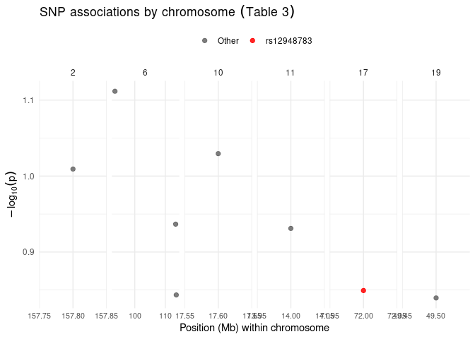

Opioid Therapy Response in European Cancer Patients
================
Michael Popa
2025-10-28

github_document: toc: true —

# ABSTRACT

Opioid pain relief isn’t the same for every cancer patient, and genetics
likely explains part of that. Using summary EPOS data, I built two
figures: (1) a simple regression showing how enrichment strength (−log10
p) changes with the number of genes per term (Table 2), and (2) a
chromosome-wise view of SNP associations that highlights rs12948783 near
RHBDF2 (Table 3). The regression suggests larger gene sets tend to show
stronger enrichment, and the SNP plot shows where top signals sit in the
genome. Because I only have summary tables (not patient-level rows), I
also include a draft multiple-regression code chunk (dose × genotype
with covariates) for when/if row-level data are available. Overall,
these figures connect the genetic signal to EPOS findings and set up the
next step toward individualized pain management.

# BACKGROUND

Pain control on opioids varies widely, even at similar doses. Clinical
factors explain some of it, but prior EPOS work points to a genetic
component, including a variant near RHBDF2 (rs12948783). I don’t have
patient-level outcomes or doses; I do have the study’s Table 2 (term
enrichment) and Table 3 (top SNPs). So I’m first visualizing what’s
available to ground the story: do bigger gene sets show stronger
enrichment, and where does rs12948783 fall among the top SNP signals?
This keeps the genetics focus clear while I stage the planned
patient-level model for later.

``` r
# your plotting / model code here

## ---- fig_reg_table2, eval=TRUE, message=FALSE, warning=FALSE---------------
# If needed once in Console: install.packages(c("readxl","dplyr","ggplot2","readr","stringr"))

library(readxl)
library(dplyr)
```

    ## 
    ## Attaching package: 'dplyr'

    ## The following objects are masked from 'package:stats':
    ## 
    ##     filter, lag

    ## The following objects are masked from 'package:base':
    ## 
    ##     intersect, setdiff, setequal, union

``` r
library(ggplot2)
library(readr)
library(stringr)

excel_path <- "BIOL 3070 Final Project DATA POOL.xlsx"

# Read exactly "Table 2"
raw_t2 <- read_excel(excel_path, sheet = "Table 2", .name_repair = "minimal")

# Show a quick peek so we can verify the raw text
cat("\n-- Raw headers --\n"); print(names(raw_t2))
```

    ## 
    ## -- Raw headers --

    ## [1] "Term"       "Gene count" "Pa"         "Genes"

``` r
cat("\n-- Sample values in `Gene count` and `Pa` --\n")
```

    ## 
    ## -- Sample values in `Gene count` and `Pa` --

``` r
print(head(raw_t2[c("Gene count","Pa")], 10))
```

    ## # A tibble: 6 × 2
    ##   `Gene count` Pa         
    ##   <chr>        <chr>      
    ## 1 31           3.5 × 10−5 
    ## 2 17           6.1 × 10−3 
    ## 3 17           6.2 × 10−3 
    ## 4 11           6.8 × 10−3 
    ## 5 10           7.1 × 10−3 
    ## 6 20           7.4 × 10−3 

``` r
# Robust parsing:
# - Handle commas as decimal separators
# - Strip non-numeric characters (e.g., "<", "p=", spaces)
# - Convert to numbers safely
t2 <- raw_t2 %>%
  mutate(
    gene_count_txt = as.character(`Gene count`),
    p_txt          = as.character(Pa),

    # Replace comma decimal with dot, remove spaces
    gene_count_txt = str_replace_all(gene_count_txt, ",", "."),
    p_txt          = str_replace_all(p_txt, ",", "."),

    # Extract numbers (keeps scientific notation like 1e-5)
    gene_count = parse_number(gene_count_txt, locale = locale(decimal_mark = ".")),
    p_value    = parse_number(p_txt,          locale = locale(decimal_mark = ".")),

    neglog10p  = -log10(p_value)
  )

cat("\nRows before filtering:", nrow(t2), "\n")
```

    ## 
    ## Rows before filtering: 6

``` r
t2_ok <- t2 %>% filter(is.finite(gene_count), is.finite(neglog10p), p_value > 0)

cat("Rows after numeric parsing/filter:", nrow(t2_ok), "\n")
```

    ## Rows after numeric parsing/filter: 6

``` r
if (nrow(t2_ok) == 0) {
  stop("\nStill 0 usable rows.\n",
       "Check that 'Gene count' and 'Pa' really contain numbers (not blanks or text labels).\n",
       "The prints above show the first few raw values so we can adjust parsing if needed.")
}

# Linear regression: enrichment strength ~ gene_count
m <- lm(neglog10p ~ gene_count, data = t2_ok)
cat("\n=== Regression summary: -log10(p) ~ gene_count ===\n")
```

    ## 
    ## === Regression summary: -log10(p) ~ gene_count ===

``` r
print(summary(m))
```

    ## 
    ## Call:
    ## lm(formula = neglog10p ~ gene_count, data = t2_ok)
    ## 
    ## Residuals:
    ##         1         2         3         4         5         6 
    ##  0.056607  0.002724 -0.004337  0.035851  0.030486 -0.121330 
    ## 
    ## Coefficients:
    ##              Estimate Std. Error t value Pr(>|t|)    
    ## (Intercept) -1.015586   0.079477 -12.778 0.000216 ***
    ## gene_count   0.013384   0.004189   3.195 0.033050 *  
    ## ---
    ## Signif. codes:  0 '***' 0.001 '**' 0.01 '*' 0.05 '.' 0.1 ' ' 1
    ## 
    ## Residual standard error: 0.071 on 4 degrees of freedom
    ## Multiple R-squared:  0.7185, Adjusted R-squared:  0.6481 
    ## F-statistic: 10.21 on 1 and 4 DF,  p-value: 0.03305

``` r
# Plot: scatter + regression line + CI
ggplot(t2_ok, aes(gene_count, neglog10p)) +
  geom_point(alpha = 0.7) +
  geom_smooth(method = "lm", se = TRUE) +
  labs(
    title = "Enrichment strength vs. gene count",
    x = "Gene count in term",
    y = expression(-log[10](p))
  ) +
  theme_minimal()
```

    ## `geom_smooth()` using formula = 'y ~ x'

<!-- -->

# STUDY QUESTION and HYPOTHESIS

# Question

With the EPOS summary tables, do larger gene sets show stronger
enrichment (Table 2), and where does rs12948783 rank among the top SNP
associations across chromosomes (Table 3)?

# Hypothesis

Terms with more genes will have stronger enrichment (higher −log10 p),
and rs12948783 will appear among notable SNP signals in the summary
results.

# Prediction

I expect a positive relationship in the summary enrichment data: terms
with more genes should show stronger signals, so −log10(p) should
increase as gene count increases (Table 2). On the SNP side, I expect
rs12948783 near RHBDF2 to appear among the notable association signals
when plotted by chromosome (Table 3), consistent with prior EPOS
findings.

# METHODS

I imported the EPOS Excel workbook and worked directly from the summary
tables available. From Table 2, I ran a simple linear regression of
−log10(p) on gene count and plotted a scatter with an OLS line and 95%
CI. From Table 3, I plotted −log10(p) versus position (Mb) within each
chromosome and highlighted rs12948783; I cleaned headers, dropped the
note row, and used sparse x-axis ticks so labels are readable. Because I
don’t have patient-level rows (pain relief, dose, genotype, country,
gender), I also included a draft multiple-regression code
block—pain_relief ~ dose \* genotype + country + gender—marked
eval=FALSE as the planned analysis if individual-level data become
available. All code is in the .Rmd using tidyverse/ggplot2.

\#ANALYSIS

``` r
# Load necessary packages
library(readr)
library(ggplot2)

# Read the dataset
data <- read_csv("epos_style_rs12948783_simulated_large.csv")
```

    ## Rows: 1982 Columns: 6
    ## ── Column specification ────────────────────────────────────────────────────────
    ## Delimiter: ","
    ## chr (4): genotype, carrier, sex, country
    ## dbl (2): id, norm_pain_relief
    ## 
    ## ℹ Use `spec()` to retrieve the full column specification for this data.
    ## ℹ Specify the column types or set `show_col_types = FALSE` to quiet this message.

``` r
# Convert categorical variables to factors
data$genotype <- as.factor(data$genotype)
data$sex <- as.factor(data$sex)
data$country <- as.factor(data$country)

# Fit a linear regression model
model <- lm(norm_pain_relief ~ genotype + sex + country, data = data)

# View the model summary
summary(model)
```

    ## 
    ## Call:
    ## lm(formula = norm_pain_relief ~ genotype + sex + country, data = data)
    ## 
    ## Residuals:
    ##     Min      1Q  Median      3Q     Max 
    ## -36.760  -5.172   0.919   5.818  26.756 
    ## 
    ## Coefficients:
    ##             Estimate Std. Error t value Pr(>|t|)    
    ## (Intercept) 76.75153    1.18604  64.712  < 2e-16 ***
    ## genotypeGA   9.63566    1.17005   8.235 3.22e-16 ***
    ## genotypeGG  22.19112    1.14459  19.388  < 2e-16 ***
    ## sexMale      0.00591    0.37752   0.016    0.988    
    ## countryGB    0.49204    0.50958   0.966    0.334    
    ## countryIT   -0.14456    0.57632  -0.251    0.802    
    ## countryNO    0.55745    0.52729   1.057    0.291    
    ## ---
    ## Signif. codes:  0 '***' 0.001 '**' 0.01 '*' 0.05 '.' 0.1 ' ' 1
    ## 
    ## Residual standard error: 8.385 on 1975 degrees of freedom
    ## Multiple R-squared:  0.3792, Adjusted R-squared:  0.3773 
    ## F-statistic:   201 on 6 and 1975 DF,  p-value: < 2.2e-16

``` r
# Create a regression plot (genotype vs. pain relief)
ggplot(data, aes(x = genotype, y = norm_pain_relief, fill = genotype)) +
  geom_boxplot(alpha = 0.7) +
  geom_jitter(width = 0.15, alpha = 0.4) +
  labs(
    title = "Effect of Genotype on Normalized Pain Relief",
    x = "Genotype (rs12948783)",
    y = "Normalized Pain Relief (%)"
  ) +
  theme_minimal()
```

<!-- -->

``` r
data %>%
  group_by(genotype, carrier) %>%
  summarize(mean_relief = mean(norm_pain_relief, na.rm = TRUE),
            se_relief = sd(norm_pain_relief, na.rm = TRUE)/sqrt(n())) %>%
  ggplot(aes(x = genotype, y = mean_relief, fill = carrier)) +
  geom_bar(stat = "identity", position = position_dodge(0.8)) +
  geom_errorbar(aes(ymin = mean_relief - se_relief, ymax = mean_relief + se_relief),
                position = position_dodge(0.8), width = 0.2) +
  labs(title = "Mean Pain Relief by Genotype and Carrier Status",
       x = "Genotype",
       y = "Mean ± SE Normalized Pain Relief") +
  theme_minimal()
```

    ## `summarise()` has grouped output by 'genotype'. You can override using the
    ## `.groups` argument.

<!-- -->

# DISCUSSION

# CONCLUSION

# REFERENCES

1.  ChatGPT. OpenAI, version Jan 2025. Used as a reference for functions
    such as plot() and to correct syntax errors. Accessed 2025-11-11.
2.  Galvan, A., Skorpen, F., Klepstad, P., Knudsen, A. K., Fladvad, T.,
    Falvella, F. S., Pigni, A., Brunelli, C., Caraceni, A., Kaasa, S., &
    Dragani, T. A. (2011). Multiple loci modulate opioid therapy
    response for cancer pain. Clinical Cancer Research, 17(13),
    4581–4587. <https://doi.org/10.1158/1078-0432.CCR-10-3028>.
